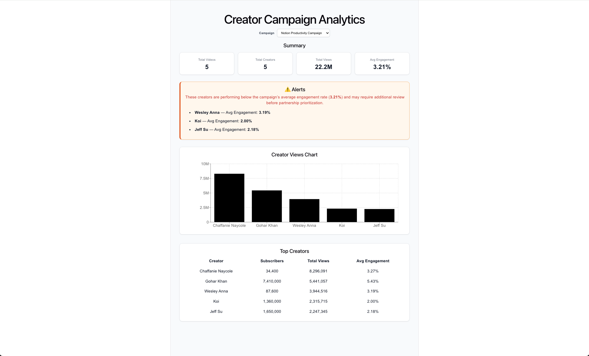

# Creator Campaign Analytics

## Overview

This project is a lightweight creator campaign analytics dashboard built for the HardScope Software Engineer Lead build challenge.

It ingests public creator performance data from YouTube, stores normalized campaign, creator, and content metrics in PostgreSQL, exposes analytics through a REST API, and visualizes the results in a React dashboard.

The goal is to demonstrate how a brand partnerships or marketing team could quickly evaluate creator reach, engagement, and relative campaign performance using publicly available data.

## Dashboard Preview

The React dashboard allows brand partnerships teams to quickly evaluate creator performance, campaign reach, and engagement trends.



## Why I Built It This Way

I modeled a campaign as a keyword or theme with optional brand context. Since private campaign spend, conversion, and attribution data are not publicly accessible, I used public YouTube creator and video performance data as a proxy for campaign reach and engagement.

Focusing on a single platform (YouTube) allowed me to build a clean, reliable end-to-end pipeline within the available time. The system architecture, however, is designed so that additional platforms (TikTok, Instagram, Twitch, etc.) could be integrated later with minimal schema changes.

## Tech Stack

### Frontend

- React
- TypeScript
- Vite
- Axios
- Recharts

### Backend

- Node.js
- Express
- TypeScript
- PostgreSQL
- Axios

### External Data Source

- YouTube Data API v3

## Architecture

The system consists of three main components:

- **Data ingestion layer** – Fetches creator and video data from the YouTube Data API and normalizes it.
- **Backend API** – Express + TypeScript service that stores data in PostgreSQL and exposes analytics endpoints.
- **Frontend dashboard** – React application that visualizes campaign metrics and creator performance.

The architecture separates ingestion, storage, and visualization so the system can be extended to support additional platforms and analytics features.

## Project Structure

```
creator-campaign-analytics/
├── client/ # React dashboard
├── server/ # Express + TypeScript API
├── docs/ # README images
└── README.md
```

## Features

- Ingests real YouTube campaign data using a keyword query
- Stores campaigns, creators, and content items in PostgreSQL
- Exposes REST API endpoints for campaign analytics
- Interactive React dashboard with:
  - campaign selector
  - summary metric cards
  - creator performance chart
  - sortable top creators table
- Supports basic analytics workflows for evaluating creator reach and engagement
- Includes an alert feature that flags creators performing below the campaign average engagement rate

## Data Source

This project uses the YouTube Data API v3 to fetch:

- video search results for a campaign keyword
- video-level public statistics
- channel-level public creator statistics

### Database Schema

The database uses three core tables:

- `campaigns` – campaign keyword and metadata
- `creators` – YouTube channel information
- `content_items` – videos associated with a campaign

This schema keeps campaign, creator, and content data separate so that analytics queries remain flexible and the model can be extended later to support:

- multiple platforms
- richer campaign metadata
- historical metric snapshots
- alerting

### Backend Services

- `youtubeService.ts`
  - fetches and normalizes YouTube API data
- `ingestService.ts`
  - inserts campaign, creator, and content data transactionally

### API Endpoints

- `GET /api/health`
- `GET /api/db-test`
- `GET /api/youtube-test`
- `POST /api/ingest`
- `GET /api/campaigns`
- `GET /api/analytics/summary?campaignId=1`
- `GET /api/analytics/top-creators?campaignId=1`

## Scheduled Data Refresh (Concept)

In production, creator campaign analytics platforms periodically refresh campaign metrics to keep engagement and reach data up to date.

This project includes a scheduled refresh concept using `node-cron`. The scheduler is disabled by default to avoid creating duplicate campaign records during development. In a production version, the scheduler would refresh metrics for existing campaigns rather than insert new campaign rows.

This approach demonstrates how the system could support recurring data ingestion without manual triggers.

## How to Run Locally

### Prerequisites

- Node.js
- PostgreSQL
- YouTube Data API key

### Backend

1. Navigate to the server folder

```bash
cd server
```

2. Install dependencies

```bash
npm install
```

3. Create a `.env` file and paste the following content into it

```env
PORT=4000
DATABASE_URL=postgresql://YOUR_USERNAME@localhost:5432/campaign_analytics
YOUTUBE_API_KEY=YOUR_YOUTUBE_API_KEY
```

Replace `YOUR_POSTGRES_USERNAME` with the PostgreSQL username configured on your machine.

### Create the Database

Before starting the server, create the database:

```bash
psql postgres
CREATE DATABASE campaign_analytics;
```

4. Start the backend server

```bash
npm run dev
```

The backend server will start at:

http://localhost:4000

## Future Improvements

- Support additional platforms (TikTok, Instagram, Twitch)
- Add historical metric tracking
- Implement background ingestion jobs
- Add campaign comparison analytics
- Improve engagement scoring models
- Extend alerting to detect engagement drops over time using historical metric snapshots
- Automated refresh pipeline (production-safe scheduled ingestion that refreshes metrics for existing campaigns rather than inserting duplicates)
